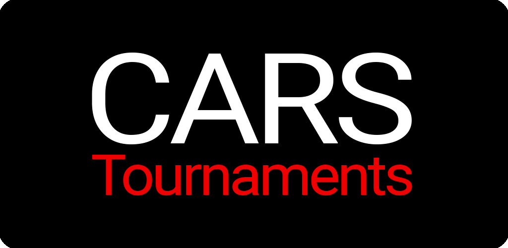

  

  ⚡️ Backend para CarsTournaments ⚡️

 

[(https://github.com/carsTournaments/backend/actions/workflows/deploy.yml)] [(https://github.com/carsTournaments/backend/actions/workflows/ci.yml)]

  

[(https://github.com/carstournaments/backend/issues)]

